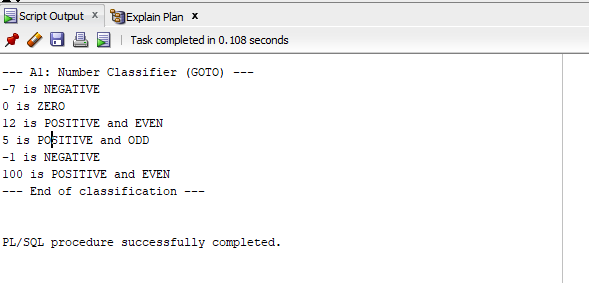
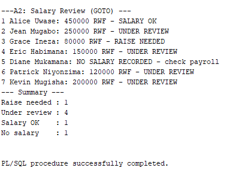
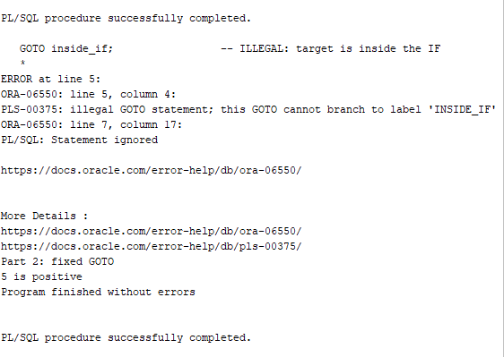
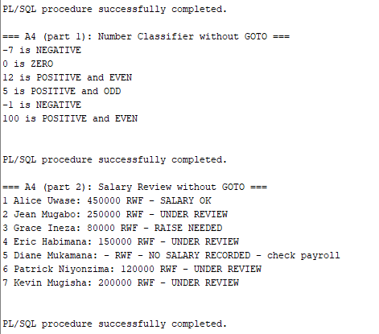
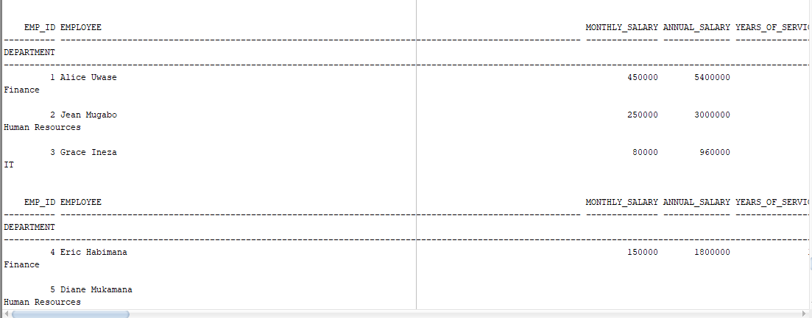
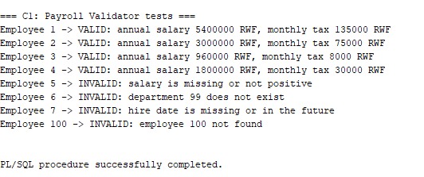
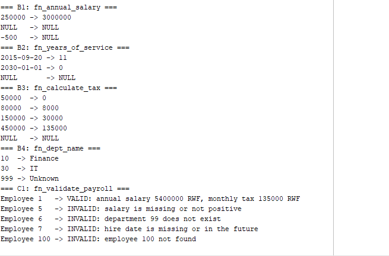

# PL/SQL GOTO Statements and Functions

**Student:** Gasana (20251SEN096)
**Course:** Database Development with PL/SQL (INSY 8311)
**Instructor:** Eric Maniraguha
**Assignment:** Individual Assignment III

## Overview

This project shows how to use `GOTO` statements, stored functions, exception handling, and functions inside SQL queries in Oracle PL/SQL.

## Repository Structure

```
00_setup/       create_tables.sql
01_goto/        A1 – A4 (GOTO programs)
02_functions/   B1 – B4 and C1 (stored functions)
03_tests/       B5 and test scripts
screenshots/    output of each task
docs/           REFLECTION.md
```

## Tables

- **departments** – `dept_id`, `dept_name`, `location` (3 rows)
- **employees** – `emp_id`, `first_name`, `last_name`, `salary`, `hire_date`, `dept_id` (7 rows)

Employees 5, 6 and 7 contain invalid data on purpose (missing salary, unknown department, future hire date) to test the validator.

## Tasks

### Part A – GOTO

| Task | Description |
|---|---|
| A1 – Number Classifier | Classifies numbers as negative, zero or positive (even/odd) using `GOTO` and labels. |
| A2 – Salary Review | Reviews each employee's salary and uses `GOTO` to print the correct decision. |
| A3 – Illegal GOTO and Fix | Shows that a `GOTO` cannot jump into an `IF` block (error PLS-00375), then fixes it. |
| A4 – Rewrite Without GOTO | Rewrites A1 and A2 using `CASE` and `IF/ELSIF`. |

### Part B – Functions

| Task | Description |
|---|---|
| B1 – `fn_annual_salary` | Returns the monthly salary × 12. |
| B2 – `fn_years_of_service` | Returns the number of full years since the hire date. |
| B3 – `fn_calculate_tax` | Returns the monthly tax: 0% up to 60,000; 10% up to 100,000; 20% up to 200,000; 30% above. |
| B4 – `fn_dept_name` | Returns the department name, or `'Unknown'` if it does not exist. |
| B5 – Functions in SQL | Uses the functions in `SELECT`, `WHERE` and `GROUP BY`. |

### Part C – Combined Task

| Task | Description |
|---|---|
| C1 – `fn_validate_payroll` | Checks an employee's salary, hire date and department, and returns `VALID` or the reason it is `INVALID`. |
| C2 – Reflection | See [docs/REFLECTION.md](docs/REFLECTION.md). |

## How to Run

Run each script in SQL Developer with **F5 (Run Script)**, in this order:

1. `00_setup/create_tables.sql`
2. The functions in `02_functions/`
3. The programs in `01_goto/`
4. The tests in `03_tests/`

## Screenshots

| Task | Screenshot |
|---|---|
| A1 |  |
| A2 |  |
| A3 |  |
| A4 |  |
| B5 |  |
| C1 |  |
| Function tests |  |

## Notes

I used an AI assistant only to help me understand the assignment questions. I ran and tested all the code myself, and I can explain it.

## Integrity Statement

This is my own individual work.
